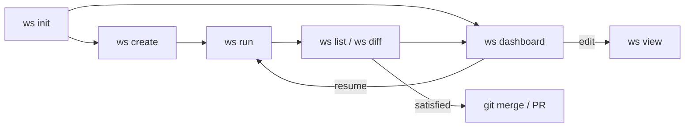

<div align="center">

# ws

**Parallel AI coding agents in isolated git worktrees.**

Experience true parallelism — stop engineering solo and start managing a team of coding agents.

[](LICENSE)
[](https://github.com/workstream-labs/workstreams/releases)

[Getting Started](https://runws.dev/getting-started/installation.html) ·
[Documentation](https://runws.dev/) ·
[GitHub](https://github.com/workstream-labs/workstreams)

</div>

---

## Why ws?

You have a list of tasks — tests to write, types to fix, docs to add. Instead of running one agent at a time, `ws` spawns them all in parallel, each in its own git worktree and branch. No conflicts between agents. No waiting.

Works with **Claude**, **Codex**, and **Aider** out of the box — or bring your own agent.

## Install

```bash
curl -fsSL https://raw.githubusercontent.com/workstream-labs/workstreams/main/install.sh | bash
```

<details>
<summary>Custom install directory</summary>

```bash
WS_INSTALL_DIR=~/.local/bin curl -fsSL https://raw.githubusercontent.com/workstream-labs/workstreams/main/install.sh | bash
```
</details>

<details>
<summary>Install from source</summary>

Requires [Bun](https://bun.sh) and at least one AI coding agent (e.g. [Claude Code](https://claude.ai/code)).

```bash
git clone https://github.com/workstream-labs/workstreams.git
cd workstreams
bun install
bun link
```
</details>

## Quick Start

```bash
# Initialize in any git repo
ws init

# Define workstreams
ws create add-tests -p "Add unit tests for the API routes"
ws create dark-mode -p "Implement dark mode toggle"

# Run all in parallel
ws run

# Review results
ws list                                    # status overview
ws diff add-tests                          # interactive diff viewer
ws dashboard                               # full TUI dashboard

# Iterate
ws run add-tests -p "Also add integration tests"

# Navigate into a workstream
cd $(ws checkout add-tests)                # enter the worktree
ws view add-tests                          # or open in your editor

# Merge when satisfied
git checkout main
git merge ws/add-tests
ws destroy add-tests                       # clean up
```

## Configuration

All config lives in `workstream.yaml`:

```yaml
agent:
  command: claude           # claude | codex | aider | /path/to/custom
  timeout: 600              # optional: kill after N seconds
  acceptAll: true           # auto-inject accept flags per agent

workstreams:
  add-tests:
    prompt: "Add unit tests for the API routes"
  dark-mode:
    prompt: "Implement dark mode toggle"
    base_branch: develop    # optional: base on a different branch
```

<details>
<summary>Agent config reference</summary>

| Field | Description | Default |
|---|---|---|
| `command` | Agent binary name or path | required |
| `args` | Extra args passed before the prompt | `[]` |
| `env` | Extra environment variables | `{}` |
| `timeout` | Timeout in seconds | none |
| `acceptAll` | Auto-inject accept/auto-approve flags | `true` |

When `acceptAll` is enabled, `ws` injects flags automatically:

| Agent | Flags |
|---|---|
| claude | `--dangerously-skip-permissions --output-format stream-json --verbose` |
| codex | `--full-auto` |
| aider | `--yes` |

</details>

## Commands

| Command | Description |
|---|---|
| `ws init` | Initialize workstreams in the current git repo |
| `ws create <name> -p <prompt>` | Add a new workstream |
| `ws run [name]` | Run all (or one) workstream in parallel |
| `ws list` | Show status, diff stats, and last commit |
| `ws dashboard` | Interactive TUI — diffs, review, resume, edit |
| `ws diff [name]` | Interactive diff viewer (`--raw` for plain output) |
| `ws view <name>` | Open in editor (`-e cursor`, `--no-editor` for path) |
| `ws checkout <name>` | Print worktree path (`cd $(ws checkout name)`) |
| `ws destroy [name]` | Remove worktree and branch (`--all` for everything) |

## Workflow



1. **Define** — describe tasks as workstream prompts
2. **Run** — agents work in parallel, each in its own worktree
3. **Review** — browse diffs, add inline comments from the dashboard
4. **Iterate** — resume agents with feedback until the code is right
5. **Merge** — squash-merge the branch or open a PR

## Uninstall

<details>
<summary>Remove ws</summary>

**Binary install:**
```bash
sudo rm /usr/local/bin/ws          # default location
rm "$WS_INSTALL_DIR/ws"            # custom location
```

**Source install:**
```bash
cd workstreams && bun unlink
```

**Clean up a project:**
```bash
ws destroy --all -y                # remove all worktrees and branches
rm -rf .workstreams                # remove state directory
rm workstream.yaml                 # remove config
```

</details>

## Development

```bash
bun test                           # run all tests
bun test tests/dag.test.ts         # run a single test
bun run src/index.ts -- --help     # run CLI directly
```

<details>
<summary>Project structure</summary>

```
src/
  index.ts              CLI entry point
  cli/                  Command implementations (init, create, run, list, dashboard, view, diff, checkout, destroy)
  core/                 Engine (config, executor, agent, worktree, state, events, comments)
  ui/                   TUI components (ansi, modal, dashboard, diff-viewer, fuzzy search)
tests/                  bun:test test files
```

**State directory** — `.workstreams/` (gitignored):
```
.workstreams/
  state.json            Run state (status, session IDs, exit codes)
  trees/                Git worktrees (one per workstream)
  logs/                 Agent log files
  comments/             Review comments (JSON per workstream)
  pending-prompts/      Continuation prompts
```

</details>

---

<div align="center">
<sub>Built by <a href="https://github.com/workstream-labs">workstream-labs</a></sub>
</div>
