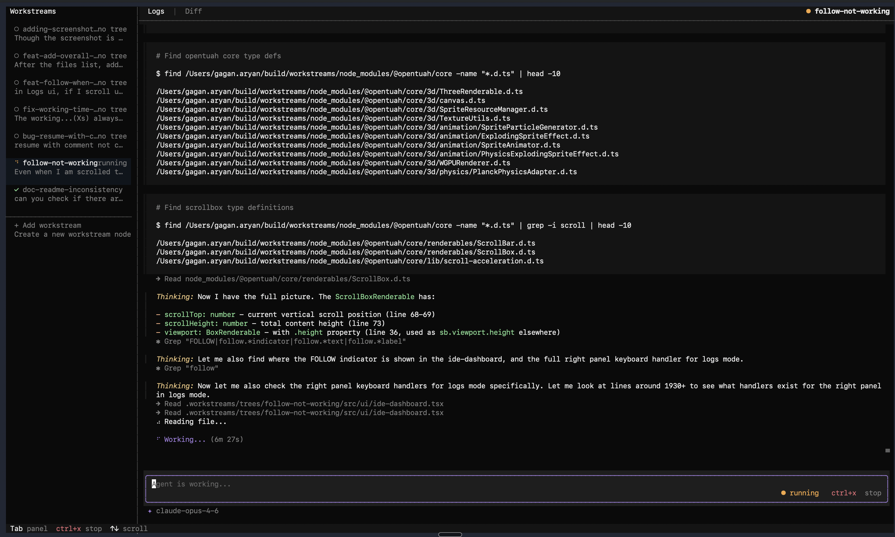

# ws

Parallel AI coding agents in isolated git worktrees.



## Install

```bash
curl -fsSL https://raw.githubusercontent.com/workstream-labs/workstreams/main/install.sh | bash
```

Or from source (requires [Bun](https://bun.sh)):

```bash
git clone https://github.com/workstream-labs/workstreams.git
cd workstreams
bun install && bun link
```

### Desktop App (dev setup)

A single script handles everything — nvm, Node 22, npm install, Electron, and compilation:

```bash
cd apps/desktop
bash install.sh
./scripts/code.sh   # launch the app
```

## Quick Start

```bash
ws init                                        # set up in any git repo
ws create add-tests -p "Add unit tests"        # define tasks
ws create dark-mode -p "Implement dark mode"
ws run                                         # run all in parallel
ws dashboard                                   # review diffs, leave comments, resume
```

Each workstream runs in its own git worktree on a `ws/` branch. When you're happy with the result, merge the branch and clean up with `ws destroy`.

See the [docs](https://runws.dev/) for configuration, commands, and guides.

## Contributing

See [CONTRIBUTING.md](CONTRIBUTING.md).

## License

[MIT](LICENSE)

---

If this is useful to you, a [star](https://github.com/workstream-labs/workstreams) helps others find it.
