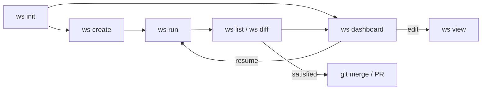

# ws — Parallel AI Coding Agent Orchestrator

`ws` spawns multiple AI coding agents (Claude, Codex, Aider) in isolated git worktrees, running them all in parallel. Define your workstreams in a YAML file, run them, review the results, and iterate.

## Install

```bash
curl -fsSL https://raw.githubusercontent.com/workstream-labs/workstreams/main/install.sh | bash
```

This downloads a standalone binary to `/usr/local/bin/ws`. To install elsewhere:

```bash
WS_INSTALL_DIR=~/.local/bin curl -fsSL https://raw.githubusercontent.com/workstream-labs/workstreams/main/install.sh | bash
```

### From source

```bash
git clone https://github.com/workstream-labs/workstreams.git
cd workstreams
bun install
bun link        # makes `ws` available globally
```

Requires [Bun](https://bun.sh) and at least one AI coding agent (e.g. [Claude Code](https://claude.ai/code)) installed and available in your `$PATH`.

## Quick Start

```bash
# 1. Initialize in any git repo
cd my-project
ws init

# 2. Add workstreams
ws create add-tests -p "Add unit tests for the API routes using pytest"
ws create dark-mode -p "Implement dark mode toggle in the React frontend"

# 3. Run all workstreams in parallel
ws run

# 4. Check results
ws list
ws diff add-tests

# 5. Review and iterate
ws dashboard               # interactive dashboard — browse diffs, resume, review
ws run add-tests -p "Also add integration tests"   # resume with new instructions
```

## Configuration

Workstreams are defined in `workstream.yaml` at the project root:

```yaml
agent:
  command: claude
  args:
    - -p
  acceptAll: true     # auto-inject --dangerously-skip-permissions (claude), --full-auto (codex), --yes (aider)
  timeout: 600

workstreams:
  add-tests:
    prompt: "Add unit tests for the API routes using pytest"
  dark-mode:
    prompt: "Implement dark mode toggle in the React frontend"
```

You can also use an array format:

```yaml
workstreams:
  - name: add-tests
    prompt: "Add unit tests for the API routes using pytest"
  - name: dark-mode
    prompt: "Implement dark mode toggle in the React frontend"
```

### Agent configuration

| Field | Description | Default |
|---|---|---|
| `command` | Agent binary name or path | — (required) |
| `args` | Extra args passed before the prompt | `[]` |
| `env` | Extra environment variables | `{}` |
| `timeout` | Timeout in seconds | none |
| `acceptAll` | Auto-inject accept/auto-approve flags | `true` |

If `claude` isn't in your `$PATH`, use the full path:

```yaml
agent:
  command: /Users/you/.npm/bin/claude
```

## Commands

### `ws init`

Initialize workstreams in the current git repo. Creates `.workstreams/` directory and `workstream.yaml`.

### `ws create <name> -p <prompt>`

Add a new workstream to `workstream.yaml`.

### `ws run [name]`

Run all workstreams in parallel (or a single one by name). Each workstream gets its own git worktree and branch (`ws/<name>`). The configured agent is spawned in each worktree with the workstream's prompt.

If a workstream already has a session, pass `-p` to resume it with new instructions. Pending review comments are automatically included.

```bash
ws run                              # run all
ws run add-tests                    # run just one
ws run --dry-run                    # show what would run
ws run add-tests -p "Fix the tests" # resume with new instructions
```

### `ws list`

List all workstreams with status, sync info, diff stats, duration, and last commit.

### `ws dashboard`

Open the interactive TUI dashboard. Browse all workstreams, view diffs, add review comments, resume agents, and open editors — all with keyboard shortcuts.

```bash
ws dashboard              # interactive dashboard
```

### `ws diff [name]`

Show the git diff for a workstream's branch. Without a name, shows diffs for all workstreams.

```bash
ws diff add-tests         # interactive diff viewer
ws diff --raw             # raw diff output for all workstreams
```

### `ws view <name>`

Open a workstream in your editor.

```bash
ws view add-tests              # open in default editor
ws view add-tests -e cursor    # open in Cursor
ws view add-tests --no-editor  # print the worktree path
```

Supported editors: VS Code (`code`), Cursor, Zed, Windsurf, WebStorm. Your choice is remembered for future sessions.

### `ws checkout <name>`

Print the worktree path for a workstream. Useful for navigating to worktrees in your shell.

```bash
cd $(ws checkout add-tests)    # navigate to the worktree
ws checkout add-tests          # print the absolute path
```

### `ws destroy [name]`

Remove a workstream's worktree and branch.

```bash
ws destroy add-tests       # destroy one
ws destroy --all           # destroy all and reset config
ws destroy --all -y        # skip confirmation
```

## Workflow



1. **Define** workstreams with prompts describing the work
2. **Run** them in parallel — each agent works in its own worktree
3. **Review** the results with `ws diff` and `ws dashboard`
4. **Iterate** using `ws dashboard` (resume, review, edit) or `ws run <name> -p "..."` (hands-off resume)
5. **Merge** when satisfied using standard git commands or GitHub PRs

## Project Structure

```
src/
  index.ts            # CLI entry point, registers all commands
  cli/                # Command implementations
    init.ts           # ws init
    create.ts         # ws create
    run.ts            # ws run (includes resume logic)
    list.ts           # ws list
    dashboard.ts      # ws dashboard (interactive TUI)
    view.ts           # ws view (open in editor)
    diff.ts           # ws diff
    checkout.ts       # ws checkout
    destroy.ts        # ws destroy
  core/
    agent.ts          # AgentAdapter — spawns agents, streams logs, captures session IDs
    config.ts         # Loads and validates workstream.yaml
    dag.ts            # Builds workstream graph
    executor.ts       # Parallel execution engine with mutex for worktree creation
    worktree.ts       # Git worktree management
    state.ts          # State persistence (.workstreams/state.json)
    events.ts         # Event bus with typed events and ring buffer
    types.ts          # TypeScript interfaces
    errors.ts         # Error hierarchy (ConfigError, AgentError, WorktreeError)
    prompt.ts         # Interactive input helpers
    comments.ts       # Review comment storage
    pending-prompt.ts # Continuation prompt storage
    notify.ts         # Desktop notifications
    session-reader.ts # Claude session ID extraction
  ui/
    ansi.ts           # ANSI escape sequences, colors, cursor helpers
    fuzzy.ts          # Fuzzy multi-term AND matching
    modal.ts          # Reusable modal overlay renderer
    choice-picker.ts  # Modal choice picker (j/k navigation)
    workstream-picker.ts  # Dashboard card layout with search
    diff-parser.ts    # Git diff parser (files → hunks → lines)
tests/                # bun:test test files
```

## State Directory

`.workstreams/` (gitignored) is created by `ws init`:

```
.workstreams/
  state.json          # Run state (status, session IDs, exit codes)
  trees/              # Git worktrees (one per workstream)
  logs/               # Agent log files (one per workstream)
  comments/           # Review comments (one JSON file per workstream)
  pending-prompts/    # Continuation prompts (one file per workstream)
```

## Development

```bash
bun test                        # run all tests
bun test tests/dag.test.ts      # run a single test file
bun run src/index.ts -- --help  # run CLI directly
```
