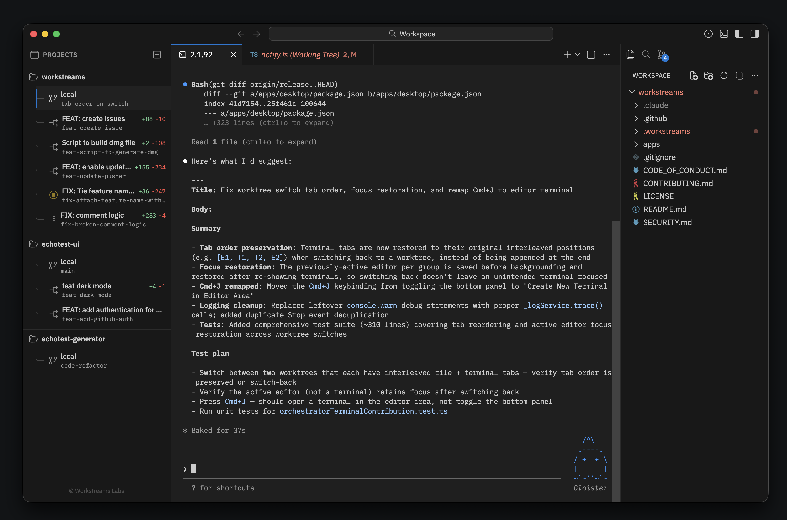
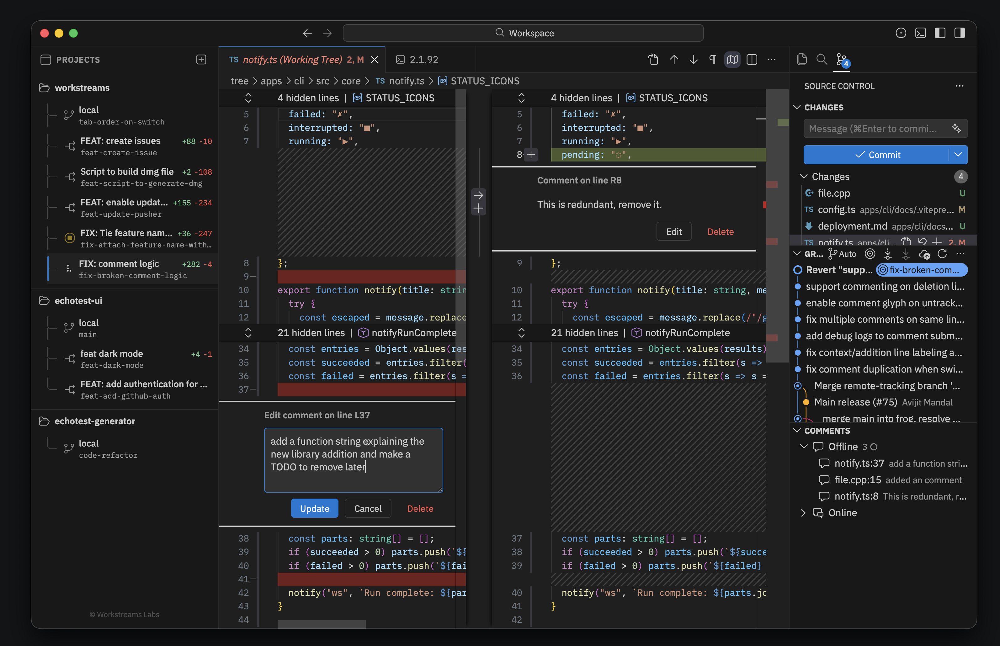
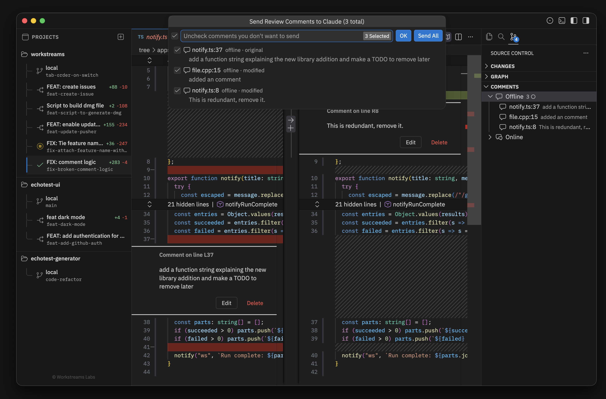
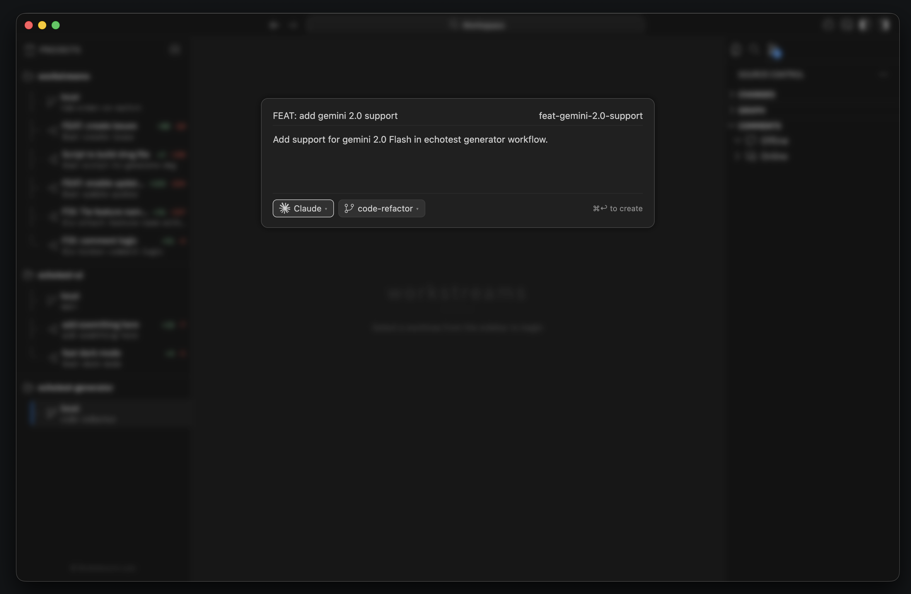

# Workstreams

An IDE for orchestrating parallel AI coding agents in isolated git worktrees.

Run multiple agents on different tasks simultaneously, review their output with inline diff comments, and iterate with a tight feedback loop — all from a single window. Agent-agnostic: works with Claude, Codex, Aider, and more.



## Download

Workstreams is available as a macOS desktop app.

**[Download the latest release](https://github.com/workstream-labs/workstreams/releases/latest)** — DMG installers for Apple Silicon (arm64) and Intel (x64).

Auto-update is built in. Once installed, the app updates itself on new releases.

## Features

### Worktree sidebar with live diff stats

The orchestrator sidebar manages multiple git worktrees per repository, showing real-time addition/deletion counts for each. Switch between worktrees to move between agent workspaces — terminals, editors, and state are preserved per worktree.

### Inline review comments

Leave comments directly on split-side diffs, then send them to Claude as structured prompts. Comments include file path, line number, and diff context so the agent knows exactly what to fix.





### Create workstreams with agent selection

Define tasks with natural language prompts and pick which agent to run. Each workstream gets its own isolated git worktree.



### Agent session state tracking

Claude Code lifecycle events (idle, working, awaiting permission, ready for review) are tracked per worktree via hooks, with animated status indicators in the sidebar.

## CLI

The CLI (`apps/cli`) provides the `ws` command for creating and running workstreams from the terminal:

```bash
ws init                                        # set up in any git repo
ws create add-tests -p "Add unit tests"        # define tasks
ws create dark-mode -p "Implement dark mode"
ws run                                         # run all in parallel
ws dashboard                                   # review diffs, leave comments, resume
```

### Install

Requires [Bun](https://bun.sh):

```bash
git clone https://github.com/workstream-labs/workstreams.git
cd workstreams/apps/cli
bun install && bun link
```

## Build from Source

### Prerequisites

- macOS
- Node.js 22 (see `apps/desktop/.nvmrc`)
- Git

### Desktop App

```bash
cd apps/desktop
bash install.sh        # sets up nvm, Node 22, npm install, Electron
./scripts/code.sh      # launch the dev build
```

See `apps/desktop/.claude/CLAUDE.md` for full DMG build instructions.

## Contributing

See [CONTRIBUTING.md](CONTRIBUTING.md).

## License

[Elastic License 2.0 (ELv2)](LICENSE)
